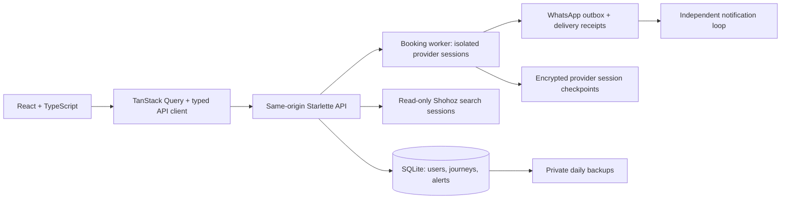

# SeatWatch — Shohoz booking website

The main website is now a **React + TypeScript** application with a responsive
coral, olive, lavender-gray, and charcoal palette, light and dark themes, locally hosted Inter typography,
accessible dialogs, and interactive search and booking screens. The Python
service continues to own authentication, availability monitoring, booking state,
manual provider sessions, and WhatsApp delivery.

SeatWatch adds a multi-user website to the original ticket-monitoring project.
Users choose a bus route, journey date, departure range, passenger details, total
budget, and a buying window in **Asia/Dhaka**. A background worker monitors fresh
offers, confirms a match twice, and prepares seats and passenger details. **The
user completes payment themselves.**

## Run the website

```bash
source .venv/bin/activate
pip install -r requirements.txt
python -m src.website.app
```

Open **http://127.0.0.1:8765**. **Explore buses** queries live Shohoz departures
without a SeatWatch account, even when booking mode is demo. Choose a route and
date, then compare fares, AC/Non-AC buses, operators, departure times and boarding
stops. Search results retain a provider session for up to five minutes; refresh
the search if it expires. A supported Chrome/Chromium installation is required
(see below); installed Google Chrome is detected automatically.

**Book tickets** at `/#/tickets` opens the official bus, train, flight, and launch
booking services in a new browser tab. This uses the customer's own provider
account for seat selection, checkout, ticket retrieval, and any supported
changes/cancellations. These are provider handoffs, not native integrations;
externally purchased tickets do not automatically sync into **My journeys**.
The current project has no partner API integration for these services. Native
multi-category inventory, booking, and ticket management remain unimplemented.

Bus listings with insufficient seats or a provider notice show an explanation
and **Continue on Shohoz**, preserving the route and date, instead of a disabled
seat button. The link opens a route search, not a specific departure or held seat.
Failed searches also offer a provider handoff. Availability and final prices are
always rechecked on the provider site.

**Select seats** requests the provider's actual map. Shohoz currently requires
sign-in for this endpoint, so anonymous users see an explanation and a link to
the same route on Shohoz. SeatWatch does not fabricate seat layouts. When a map
is available, selection records preferences and does not itself hold a seat.
**Watch bus** creates a watch for the exact live departure. The wizard explicitly
offers **Notify me only** or **Prepare a booking in my time window**. Watching
always uses live inventory and never reserves, including general route watches
and when the server is in demo mode. WhatsApp delivery still requires setup.
Specific-seat requests default to waiting for those exact seats; substitution
requires choosing **Allow other eligible seats on this bus**.

For the simulated booking flow, open **My journeys**, create an account, and
choose **Plan a journey**. The default `BOOKING_MODE=demo` uses simulated inventory
for general requests with demo preparation selected, without reservations,
messages, or charges.
Use the default departure range and a budget of at least **650 BDT per seat**.
After two observations, open the journey and choose **Simulate my payment**.

The new website is separate from `python -m src.main`, the original single-user
MCP dashboard. Do not start both on the same port. The website uses Playwright
directly so each live booking has its own isolated browser context; it does not
require the old shared MCP server.

## React development and architecture

The production frontend is already built in `src/website/static/react/`, so the
Python command above serves the upgraded website without a separate Node server.
Restart an existing Python server after upgrading; use **Ctrl+Shift+R** once in
your browser. Stop the old server with **Ctrl+C** before restarting on port 8765.

For frontend development, use **Node 22.12+** and keep the Python server running:

```bash
cd frontend
npm ci
npm run dev
```

Open **http://127.0.0.1:5173** for hot updates. Vite proxies `/api` to Python on
8765. To publish local UI changes into the Python-served build:

```bash
npm run build
```

The frontend follows [React's Vite setup guidance](https://react.dev/learn/build-a-react-app-from-scratch)
for an app backed by an existing API. Dependencies are locked in
`frontend/package-lock.json`; the CI workflow checks formatting, compiles
TypeScript, builds the frontend, then runs the Python tests.



- `frontend/src/pages/`: search, journeys, notifications, and connection screens.
- `frontend/src/components/`: accessible dialogs, booking wizard, shared UI, and
  original SVG travel illustrations.
- `frontend/src/lib/`: typed API contracts, account context, and query cache.
- React Router uses hash routes, preserving browser navigation without catch-all
  backend routes. Existing `?job=` notification links open journey details.
- Account queries are scoped to the current user and cleared on logout. Polling
  pauses in background tabs; booking mutations are never automatically retried.
- Live searches remain explicitly submitted, with incremental result rendering,
  filter controls, failure states, and seat-map sign-in handling.
- Content-hashed bundles have immutable cache headers; API responses remain
  `no-store`. Fonts, scripts, and illustrations are served locally under the
  existing strict content security policy.
- Theme preference is the only value stored in browser local storage. Passenger
  details and session tokens are not stored there. Animations respect reduced
  motion preferences. The Inter license is in `frontend/INTER-LICENSE.txt`.

This improves the application structure and interface; provider sign-in,
WhatsApp onboarding, live reservation validation, and production hosting still
require the setup described below.

## Implementation plan and current status

| Phase | Status |
| --- | --- |
| Correct independent offer fares, availability and departure identity | Implemented with regression tests |
| Accounts, private booking requests, persistence and Bangladesh buying windows | Implemented |
| Fresh monitoring, quantity-aware budgets, pause/resume and duplicate-reservation protection | Implemented |
| Shohoz seat/passenger preparation and manual provider-session controls | Adapter implemented; real reservation validation still required |
| WhatsApp templates, consent, alert deduplication and signed delivery receipts | Implemented; account credentials and approved template required |
| Responsive website and demo booking/payment flow | Implemented |
| Public live bus search, filters, sorting, stops and exact-departure watches | Implemented and checked against Shohoz |
| Native seat-map display and seat preferences | Implemented; anonymous Shohoz sessions require provider sign-in |
| Explicit watch/preparation choice, exact-seat fallback and departure cutoff | Implemented and tested |
| Concurrent jobs, independent notification dispatch, bounded browser capacity and health checks | Implemented for a single Linux server |
| Encrypted provider checkpoints and manual reconnect without replay | Implemented; real provider session restoration remains unverified |
| One-use account recovery codes, private backups/restore and operations CLI | Implemented and tested |
| Live account onboarding, real provider/payment validation and public hosting | Pending external setup |

The public Shohoz application was inspected on 2026-10-01. Read-only searches
returned hundreds of live Dhaka–Bogura departures with fares and seat counts.
The seat-layout endpoint returned HTTP 401 and opened Shohoz's embedded sign-in
page. **No live reservation, payment, or WhatsApp delivery has been verified**.
Changed provider layouts fail into
`NEEDS_ATTENTION`, rather than guessing another button or repeating a reservation.

## Live Shohoz setup

```bash
python -m playwright install --with-deps chromium
```

Alternatively set `BROWSER_EXECUTABLE` to an installed Chrome executable. Keep
demo mode until the current provider flow is validated. Then set:

```dotenv
BOOKING_MODE=live
WEBSITE_PUBLIC_URL=https://your-domain.example
WEBSITE_SECURE_COOKIES=true
WEBSITE_POLL_SECONDS=60
```

Live reservations use fresh `app-trip` cards, select eligible seats, enter the
requested boarding point and passenger details, and stop at Shohoz’s review/pay
page. Ambiguous fares, fees, missing boarding points, OTP/CAPTCHA, and changed
layouts require user attention. The total including fees must be identified and
remain within the request’s budget before the worker reports payment readiness.
Front/middle are preferences; window/aisle automation is deliberately unavailable
until a verified seat-map adapter exists. Female-restricted seats are not chosen
automatically. International passenger document flows are not supported.

**Manual payment uses the same private browser session**, avoiding a broken link
to a payment page whose cookies belong to another browser. In Journey Details,
choose **Pay in my provider session**, click its screenshot to focus fields/buttons, and use
the input and scroll controls. Typed payment values are relayed without being
saved in the application database. No automation chooses a payment method or
submits payment. The provider must expose a confirmed page and booking reference
before a live request is marked `CONFIRMED`.
If the confirmed page exposes a ticket-PDF download, SeatWatch stores that
provider-supplied PDF and makes it available only to the booking's owner.
The preview can be enlarged and scrolled on a phone. Payment alerts link to the
private journey and open its active provider session after sign-in. You can copy
the same journey link from its details to another device; payment is still in the
server's browser, using the same provider cookies.

Keep the application running during a booking. If it restarts while preparing a
reservation or waiting for live payment, the request requires attention and is
**not automatically replayed**. Closing a SeatWatch request does not claim to
cancel any existing reservation with Shohoz.
Saved cookies/local storage and the last supported Shohoz page are encrypted on
disk and expire after 24 hours. **Reconnect saved session** restores and inspects
that state; it does not select seats, submit passenger forms, or pay. Shohoz may
invalidate a session, and browser session storage/in-memory state is not
checkpointed, so recovery is best effort. If only sign-in interrupted monitoring,
complete it in the embedded provider login then choose **Resume monitoring**.
Once seat selection may have begun, automatic resume is disabled.

## WhatsApp setup

Use Meta’s WhatsApp Business Cloud API. See [Meta’s official examples](https://github.com/fbsamples/whatsapp-api-examples)
and [Meta’s Cloud API collection](https://www.postman.com/meta/whatsapp-business-platform/documentation/wlk6lh4/whatsapp-cloud-api).

1. Create the business/app account and register a sending phone number.
2. Create and obtain approval for a booking-update template. This implementation
   sends **one body text parameter**, so an example template body is:
   `Your SeatWatch booking update: {{1}}`. Meta decides template approval and category.
3. Set `WHATSAPP_ACCESS_TOKEN`, `WHATSAPP_PHONE_NUMBER_ID`,
   `WHATSAPP_API_VERSION` (the supported version from your Meta app),
   `WHATSAPP_TEMPLATE_NAME`, and `WHATSAPP_TEMPLATE_LANGUAGE` in the server’s `.env`.
4. Configure the HTTPS callback `https://your-domain.example/webhooks/whatsapp`,
   `WHATSAPP_VERIFY_TOKEN`, and `WHATSAPP_APP_SECRET`. Subscribe to message status
   updates. The app verifies webhook signatures and stores delivery receipts.

Users explicitly opt into alerts for their request. Alerts cover low remaining
seats, payment readiness, approaching payment expiry (when the provider exposes
a deadline), confirmation, and required intervention. Low-seat alerts are based
on observed inventory, not a prediction that a bus will certainly sell out.
Low-seat alerts still fire when there are fewer seats than the requested quantity
or the fare exceeds the budget. Specific-seat watches inspect eligibility and
record missing seats; a disappeared departure is described as unlisted, not
assumed sold out. Each alert kind is deduplicated per departure/request.

Demo messages are **previews**. Live messages with missing credentials show
**Setup required**. A successful API response is **Accepted**, not **Delivered**;
delivery/read statuses come from signed webhooks. Rate-limited sends retry with
backoff; ambiguous network outcomes are not replayed automatically.
Notifications have their own loop so a slow provider search does not stop delivery.
Availability messages older than 15 minutes and obsolete payment prompts expire
without sending. In-app history remains visible.

## Account recovery and local operations

In **Connections**, enter your current password to generate a recovery code.
Store it somewhere private, outside this website. Only a hash is saved in the
database. **Sign in → Use a recovery code** resets the password, consumes the code,
and signs out all previous sessions. Generate a new code after using it. This
works without an email service; email and phone ownership verification are not
implemented yet.

```bash
source .venv/bin/activate
python -m src.website.manage doctor
python -m src.website.manage status
python -m src.website.manage backup
# Restores into a NEW directory and leaves current data untouched:
python -m src.website.manage restore data/backups/CHOOSE_BACKUP.zip data-restored
```

Backups run on startup and every 24 hours, retaining the latest seven in
`data/backups/`. They use SQLite's online backup API and include tickets plus
encrypted provider checkpoints and their encryption key. **The ZIP archive is
private but not encrypted: it contains passenger data and credentials needed for
session recovery.** Copy backups to private storage on another disk to survive
disk loss. A same-disk backup only protects against some application/data errors.
Restore validates the archive and database, refuses to overwrite a directory,
and marks unfinished live reservations for manual reconciliation. Stop the server,
set `WEBSITE_DATABASE=data-restored/tickets.sqlite3`, and restart to use restored
data. Do not restore while another server is using the destination database.

`GET /api/health` returns 200 when the database and worker/notification heartbeats
are healthy, otherwise 503. `manage status` shows counts and last backup/worker
heartbeats without printing passenger details. `manage doctor` shows missing local
configuration without printing tokens. An optional Linux user-service template
is in `scripts/seatwatch.service`; edit its two absolute paths for your checkout
before installing it. Stop any manually started server on the same port first.

```bash
mkdir -p ~/.config/systemd/user
cp scripts/seatwatch.service ~/.config/systemd/user/seatwatch.service
systemctl --user daemon-reload
systemctl --user enable --now seatwatch.service
systemctl --user status seatwatch.service
journalctl --user -u seatwatch.service -n 50
```

The service restarts after a crash while your user service manager is running.
For operation after logout/reboot, configure your host's user-service persistence
or a system service. Monitoring also requires the machine to stay awake and online.

## Storage, hosting and tests

- SQLite persists users, hashed passwords, hashed session tokens, booking requests,
  events, and notification status under `data/` (ignored by Git).
- APIs enforce account ownership; cookies are HTTP-only and same-site, mutations
  require a request header, authentication attempts are rate limited, and browser
  sessions are separate per booking.
- Run **one application process** with persistent storage. A Linux file lock
  rejects a second worker on the same database. Do not use Uvicorn `--workers`
  or hot reload for real bookings. Defaults allow two concurrent jobs, four total
  provider browsers and two public search sessions. Monitoring releases its
  browser between polls. Idle manual sessions close after 20 minutes and retain
  an encrypted recovery checkpoint where supported.
- For public hosting, use HTTPS, secure cookies, a private persistent data volume,
  backups and a process supervisor. Email/phone verification, a shared distributed
  queue, multi-server deployment and large-scale capacity testing remain future work.
  The current design is intended for a small pilot on your existing computer.
- `WEBSITE_HOST`, `WEBSITE_PORT`, `WEBSITE_PUBLIC_URL`, and other options are listed
  in `.env.example`. Do not commit credentials or passenger data.

```bash
python -m pytest -q
npm --prefix frontend run build
# Isolated React browser test using explicit fixtures; no existing server needed:
python scripts/react_smoke.py
# Optional read-only Shohoz integration check (isolated server on port 8767):
python scripts/search_smoke.py
# Native seat UI and selected-bus handoff without contacting Shohoz:
TICKET_SEARCH_FIXTURE=1 python scripts/search_smoke.py
```

The tests cover ownership isolation, invalid windows, quantity and currency
constraints, two-observation preparation, no automatic payment confirmation,
pause/resume, restart recovery, parser regressions, WhatsApp payloads and signed
receipts. The React browser test covers signup, exact-departure watches, seat
preferences, a two-passenger demo request, manual demo payment, notification
previews, pause/resume, logout, themes, JavaScript errors, and mobile overflow at
320, 390, and 768 pixels. Screenshots are written to `/tmp/seatwatch-react`.
`scripts/browser_smoke.py` is a compatibility entrypoint for this same test.
Search tests also cover public access, provider failures without sample fallbacks,
expired browser sessions, exact-departure matching, and watch-only requests that
never reserve. The live browser check accepts Shohoz's explicit sign-in requirement
for seat maps; the fixture check exercises the native seat selector separately.
Reliability tests additionally cover atomic duplicate submissions, low-seat
shortages, exact-seat fallback, cutoffs during verification, bounded retries,
concurrent scheduling, stale-alert suppression, one-use recovery codes, session
encryption, worker locking, and backup/restore without reservation replay.

## Original single-user MCP monitor

A **safe starter template** for a ticket-monitoring and checkout assistant using:
- a deterministic state machine
- confidence-scored parsing
- business policy guardrails and offer scoring
- adaptive single-page or multi-page monitoring
- MCP-compatible browser automation
- explainable human handoff for sensitive steps

This template is intentionally conservative:
- no stealth plugin
- no CAPTCHA bypass
- dry-run mode enabled by default
- payment execution is guarded by policy checks and human confirmation hooks

## Project goals

1. Monitor an event page for availability changes
2. Parse page state into a structured status
3. Require confidence thresholds and confirming snapshots before acting
4. Use MCP browser tools through a wrapper layer
5. Rank valid offers using hard policy constraints plus soft preferences
6. Log every action and keep screenshots / audit events
7. Stop immediately if price caps or business rules are violated

## Quick start

### 1) Create environment
```bash
python -m venv .venv
source .venv/bin/activate
pip install -r requirements.txt
cp .env.example .env
```

### 2) Start the Playwright MCP server
In your MCP host or compatible IDE, use the included `mcp_config.json`.

If you want to run the server manually:
```bash
npx @playwright/mcp@latest --port 8931
```

The app expects streamable HTTP transport and connects to `MCP_SERVER_URL`, which defaults to `http://localhost:8931/mcp`.

### 3) Run the app
```bash
python -m src.main
```

The app starts a local dashboard and prints its URL, for example:

```text
Dashboard: http://127.0.0.1:8765
```

Open that URL to see live monitor status, top ranked offers, policy decisions,
price/seat changes, screenshots, and the final decision brief. The process keeps
serving the dashboard after the run reaches a final state; press `Ctrl+C` in the
terminal when you are done viewing it.

## Notes

- `src/browser/session.py` contains a thin wrapper where you can connect your MCP client implementation.
- `src/monitoring/availability_parser.py` converts text / snapshot output into structured states.
- `src/monitoring/scheduler.py` adapts polling delay per target based on status and belief score.
- `src/monitoring/extractors/` contains the regex fast path and a semantic extraction hook.
- `src/policy.py` contains hard limits plus offer ranking metadata.
- `src/analytics/` reads audit events back for drop-window and site-reliability summaries.
- `src/ui/` serves the local browser dashboard.
- `src/reports/` writes `logs/reports/latest_offer_report.json` and `.txt`.
- `DRY_RUN=true` is recommended until you fully test your flow.
- Use `MAX_TOTAL_PRICE` and `PRICE_CURRENCY` for the active site. `MAX_TOTAL_USD` is still accepted for backward compatibility.

## Ranking preferences

Optional scoring preferences:

```bash
PREFERRED_OPERATORS=SHYAMOLI PARIBAHAN,Hanif Enterprise
AVOID_OPERATORS=
PREFERRED_DEPARTURE_START=12:00 PM
PREFERRED_DEPARTURE_END=06:00 PM
AVOID_NIGHT_BUSES=true
TARGET_ORIGIN=Dhaka
TARGET_DESTINATION=Bogura
```

The scorer still enforces hard limits first: max tickets, max total price,
blocked keywords, avoided operators, and non-positive fares.

## Multi-target monitoring

By default the app monitors `TARGET_EVENT_URL`. To monitor multiple pages, set
`MONITOR_TARGETS_JSON` to a JSON list:

```bash
MONITOR_TARGETS_JSON='[
  {"id":"event-a","url":"https://example.com/a","label":"Event A","priority":1.0},
  {"id":"event-b","url":"https://example.com/b","label":"Event B","priority":1.5,"poll_min_seconds":5,"poll_max_seconds":45}
]'
```

The scheduler polls higher-belief targets more aggressively and backs off after repeated sold-out snapshots.
